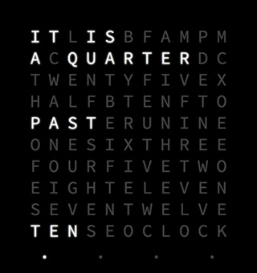

[DEMO](https://bestguy.github.io/svelte-word-qlock/)

# Web-based word clock using:

* [Svelte](http://svelte.technology/)
* [ES6 (via BabelJS)](http://babeljs.io/)
* [Webpack](http://webpack.github.io)

----

## Install & Run:

### Development:

    npm install
    npm start
    open http://localhost:3000

### Production:

    npm install
    webpack -p
    Host Qlock.js wherever you'd like.
